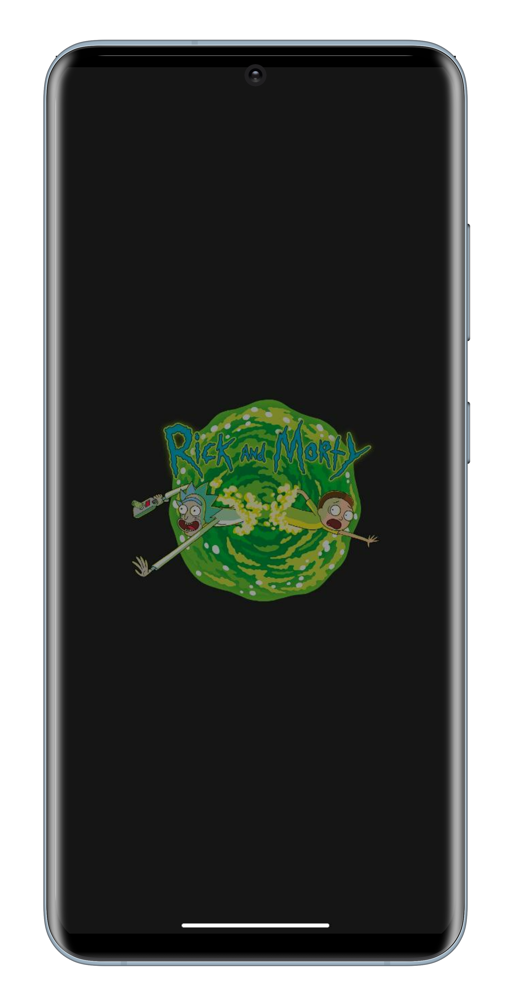
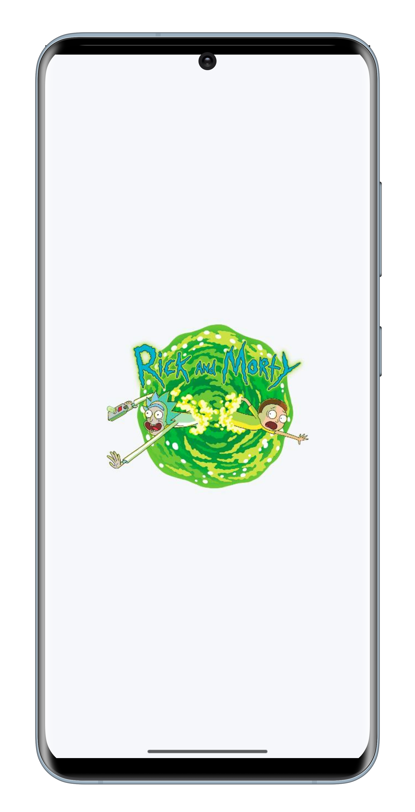

<h1 align="center">RickAndMorty - тестовое задание</h1>

Приложение постранично отображает персонажей «Рик и Морти». При тапе на персонажа открывается экран с дополнительной информацией о персонаже.

    
    
    

    
    
    

